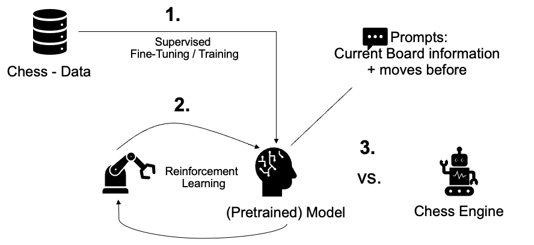

# ChessLLM
We explore whether Large Language Models can learn strategic chess play through language-based pattern recognition as an 
alternative to traditional tree-search approaches. Our ChessLLM framework trains the Llama 3.2-3B to process chess positions 
represented in Forsyth-Edwards Notation (FEN) and output moves in Universal Chess Interface (UCI) format. 
The training procedure combines supervised fine-tuning on over one million chess moves from LumbrasGigaBase 
with reinforcement learning via GRPO on more than 130,000 chess moves. To evaluate our model, we let it play against Stockfish and Recursive Minimax with Alpha–Beta.

Model Pipeline: 



## Overview
```
.
├── pretrain_transformer.py     # Supervised pre-training for transformer policy network
├── train_ppo_transformer.py    # RL fine-tuning of transformer policy (episodic training; W&B logging)
├── train_grpo_llm.py           # GRPO prompt generation and dataset creation for LLM fine-tuning
├── inference_transformer.py    # Inference-time move selection using trained transformer policy against Minimax algorithm
└── inference_llm.py            # Inference-time move generation using fine-tuned language model against Stockfish or Minimax algorithm
```

Run supervised fine-tuning of the LLM with 4 GPUs in DDP:
```cmd
accelerate launch --config_file utils/accelerate_multi_gpu.yaml finetune_llm.py
```

## Trained Models
We distinguish between three different reinforcement learning reward functions:
1. Win/Draw/Loss: The model is rewarded for winning, drawing, or losing a game.
2. Material Advantage: The model is rewarded for gaining material advantage over the opponent.
3. Win/Draw/Loss & Material Advantage: The model is rewarded for winning, drawing, or losing a game and for gaining material advantage over the opponent.

The trained LLMs are available on Hugging Face:
- Supervised fine-tuning on LumbrasGigaBase dataset: [Llama 3.2 3B Chess LLM](https://huggingface.co/JonasNasimzada/llama-3.2-3b-chess_supervised_finetuned)
- [Win/Draw/Loss](https://huggingface.co/JonasNasimzada/llama-3.2-3b-chess_grpo_win_draw_loss/)
- [Material Advantage](https://huggingface.co/JonasNasimzada/llama-3.2-3b-chess_grpo_material_advantage/)
- [Win/Draw/Loss & Material Advantage](https://huggingface.co/JonasNasimzada/llama-3.2-3b-chess_grpo_win_draw_loss_material_advantage/)

## Install Environment

`conda create -n chessllm python=3.10 -y`

`conda activate chessllm`

### Required packages

`pip install torch torchvision torchaudio --index-url https://download.pytorch.org/whl/cu128`

`pip install python-chess stockfish pandas wandb`

#### Additional packages for finetuning & reinforcement learning the LLM

`pip install unsloth transformers datasets accelerate evaluate sentencepiece protobuf tiktoken trl peft importlib-metadata vllm`

#### Optional packages for training the LLM with FlashAttention for faster training

`pip install ninja packaging`

`MAX_JOBS=8 pip install flash-attn --no-build-isolation`

## Download the Stockfish binary

Download the Stockfish binary for your system from the [official repository](https://stockfishchess.org/download/):

After downloading, unpack it with:

```bash
tar -xvf <stockfish>.tar.gz
```
## Dataset
The [LumbrasGigaBase](https://lumbrasgigabase.com/en/download-in-pgn-format-en/) dataset is used.

To extract the chess moves per game from the dataset, you can use the `utils/convert_pgn_to_fen.py` script provided in the repository.

For converting the CSV file to prompts for the LLM, you can use the `utils/create_prompt_dataset.py` script.
